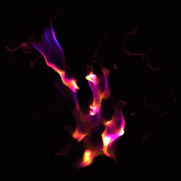

# Everyday One Motion - 20160114  

"Ether"  

  

WebGL, GPGPU Particle, Noise Based Particle  

[Everyday One Motion](http://motions.work/motion/63)  
[Demo Page](http://fms-cat-eom.github.io/20160114)  

実は2D（！）  
パーティクルは65536粒  

## Noise Based Particle
加速度を位置によるSimplex Noiseにより変化させている  

図：赤い箇所（Xが+の箇所）でパーティクルにX+の加速度が掛かっていることがわかる

## Perfect Loop Particle
[前回](https://github.com/FMS-Cat/eom_20160107)質問があったので  
GIFの1ループと全く同じ周期で、寿命と初期位置と初期速度と周期内の生成タイミングが全く同じパーティクルを生成させる  
GIF1ループ分処理を回せば自然とperfect loopが出来上がる

## 今回のパス
    10 times {
      - ノイズフィールド計算
      - パーティクル計算
      - パーティクル描画
      - ブラー
    }
    - ガンマ補正
